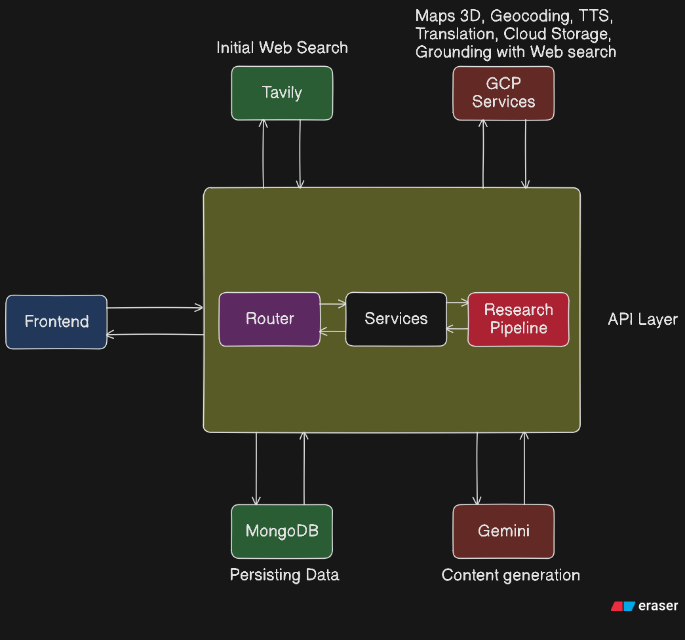
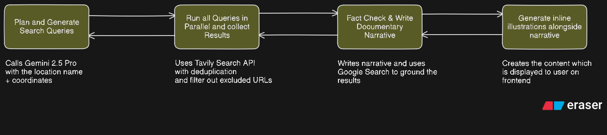

# Tapestry

**Interactive location-based historical research powered by AI.**

Click anywhere on a 3D globe → Get a rich, multi-layered historical documentary with AI-generated imagery, streaming audio narration, and four distinct visual presentation modes.

Built for the **Gemini Live Agent Challenge** hackathon. #GeminiLiveAgentChallenge

---

## Features

- **3D Globe Exploration** — Interactive Google Maps globe with reverse geocoding
- **AI-Powered Research** — Grounded historical narratives synthesized from real web sources (Tavily + Gemini)
- **Multimodal Storytelling** — Text, AI-generated images (Imagen), and streaming audio narration (Cloud TTS) woven together
- **Four Display Modes:**
  - **Ancient Scroll** — Parchment paper with wooden rollers, SVG torn edges, drop caps
  - **Stone Tablet** — Carved granite timeline with rough-hewn edges, Roman numerals
  - **Celluloid Film** — Vintage film strip with sprocket holes, grain, light leaks
  - **Hardcover Book** — Leather-spined flipbook with page-turn animations
- **Full Translation** — 15+ languages via Google Cloud Translate
- **Research History** — Every story saved, accessible from sidebar
- **Share Links** — Public URLs with unique tokens for any research
- **PDF Export** — Print-ready export via `react-to-print`

---

## Architecture





---

## Tech Stack

| Category | Technologies |
|----------|--------------|
| **Frontend** | Next.js 15, TypeScript, Tailwind CSS v4, Framer Motion |
| **UI Components** | shadcn/ui, Radix UI primitives |
| **3D Globe** | Google Maps 3D (`gmp-map-3d`) |
| **AI/ML** | Gemini 2.5 Pro, Gemini 2.5 Flash Image, Google Imagen |
| **Google Cloud** | Text-to-Speech, Cloud Translate, Cloud Storage, Maps Embed API |
| **Search** | Tavily API (grounded web search) |
| **Database** | MongoDB Atlas |
| **Auth** | JWT-based stateless sessions |
| **Deployment** | Google Cloud Run |

---

## Getting Started

### Prerequisites

- Node.js 20+
- MongoDB Atlas account
- Google Cloud project with APIs enabled
- Tavily API key

### Installation

```bash
# Clone the repository
git clone https://github.com/SarthakRawat-1/tapestry
cd tapestry

# Install dependencies
npm install

# Copy environment variables
cp .env.example .env.local

# Fill in your API keys in .env.local
```

### Environment Variables

| Variable | Required | Description |
|----------|----------|-------------|
| `MONGODB_URI` | Yes | MongoDB Atlas connection string |
| `MONGODB_DB_NAME` | Yes | Database name (e.g., `history`) |
| `GEMINI_API_KEY` | Yes | Gemini API key for AI research |
| `TAVILY_API_KEY` | Yes | Tavily search API key |
| `NEXT_PUBLIC_GOOGLE_MAPS_API_KEY` | Yes | Google Maps API key (enable Map Tiles + Maps JavaScript API) |
| `JWT_SECRET` | Yes | Secret for signing session tokens |
| `GOOGLE_CLOUD_API_KEY` | Optional | For TTS and Translate |
| `GCS_BUCKET_NAME` | Optional | Google Cloud Storage bucket |
| `GCS_CREDENTIALS` | Optional | Service account JSON (for image persistence) |

### Development

```bash
npm run dev
```

Open [http://localhost:3000](http://localhost:3000)

### Production Build

```bash
npm run build
npm run start
```

---

## How It Works

### Research Pipeline (4 Stages)

1. **Plan** — Gemini generates 10-12 targeted search queries covering history, culture, people, events
2. **Search** — Tavily executes queries in parallel, retrieves text sources + images
3. **Synthesize** — Gemini + Google Search grounding produces structured JSON narrative (6-act structure)
4. **Illustrate** — Gemini Flash generates interleaved text + AI images in a single pass

### Grounding Architecture (Anti-Hallucination)

- Retrieve real web sources **before** generating narrative
- Synthesize from provided sources, not training data
- Enforce strict JSON schema validation
- Cite all sources with `grounded: boolean` flags visible to users

### Streaming

- **Pipeline progress** — Live SSE updates as each stage completes
- **Audio narration** — Chunks stream at ~50 words; playback starts in 2 seconds
- **Images** — Progressive loading as Imagen generates them

---

## Project Structure

```
tapestry/
├── src/
│   ├── app/
│   │   ├── api/
│   │   │   ├── auth/              # JWT auth endpoints
│   │   │   ├── research/          # tasks, share, translate, tts, imagen
│   │   │   └── storytelling/      # Research pipeline orchestrator
│   │   ├── share/[token]/         # Public share pages
│   │   └── page.tsx               # Main globe + research interface
│   ├── components/
│   │   ├── display-modes/         # Scroll, Timeline, Flipbook, Film
│   │   ├── ui/                    # shadcn primitives
│   │   ├── globe.tsx              # Google Maps 3D wrapper
│   │   └── history-research-interface.tsx
│   └── lib/
│       ├── research-pipeline.ts   # 4-stage orchestrator
│       ├── research-schema.ts     # TypeScript + JSON schema
│       ├── gemini-client.ts       # Gemini SDK wrapper
│       ├── tavily-client.ts       # Search API client
│       ├── mongodb.ts             # DB connection
│       ├── db.ts                  # CRUD operations
│       └── gcp/storage.ts         # GCS image/audio persistence
├── public/
├── package.json
├── next.config.ts
├── tsconfig.json
└── README.md
```

---

## Display Modes

| Mode | Description | Best For |
|------|-------------|----------|
| **Ancient Scroll** | Parchment paper, wooden rollers, torn SVG edges, drop caps | Long-form immersive reading |
| **Stone Tablet** | Dark granite timeline, chiseled text, Roman numerals, rough edges | Chronological exploration |
| **Celluloid Film** | Vintage film strip, sprocket holes, grain, light leaks | Visual storytelling with AI images |
| **Hardcover Book** | Leather spine, page-turn animation, running headers | Traditional book experience |

---

## Links

- **Demo Video:** [Watch on Vimeo](https://vimeo.com/1174045515?share=copy&fl=sv&fe=ci)
- **Blog Post:** [Building Tapestry: How We Taught an AI to Tell History Like a Documentary](https://dev.to/shogun_the_grt/building-tapestry-how-we-taught-an-ai-to-tell-history-like-a-documentary-5cfn)


---

## License

MIT License — see [LICENSE](./LICENSE) for details.

---
